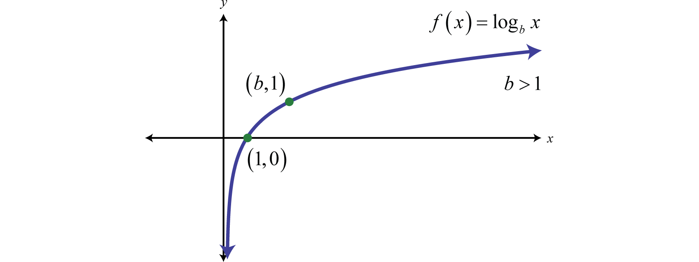
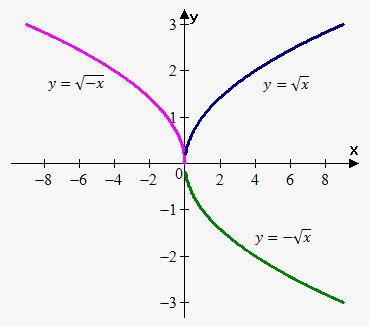

```{r setup, include=FALSE}
knitr::opts_chunk$set(echo = TRUE)
```

#### M-number: M12467636

**Evaluation: 100% - Varun Raj, Rayabarapu** 

#### Getting the important libraries

```{r ,message=FALSE, warning=FALSE}
library(dplyr)
library(ggplot2)
library(knitr)
library(GGally)
library(grid)
library(gridExtra)
library(DAAG)
```

## Compressive Strength of the Concrete Predictor

## Abstract:

Compressive Strength of the Concrete is crucial to be known, given the amount of each of its component used. This project will develop a linear model with transformation to define the Compressive Strength. Initially, the data is explored thoroughly to get the most out of it. That is the behaviour of the Strength with the varying amounts of its constituents is studied. This made the identification of least correlated components. Based on these behaviours appropriate transformations are done to these covariates, then these models are checked for the LINE assumptions. A three-stage remodelling is done until the final desired model is achieved. Once the model passed adequacy test, it is validated using K-fold Cross Validation and predictions were made to assess the performance.      

## Chapter 1: Motivation

The compressive strength of concrete is the most common performance measure used by the engineer in designing buildings. It is important to predict the compressive strength of the concrete to assure that it is best suited for the construction type, that is, the requirements can vary from 17 MPa for residential concrete to 28 MPa and higher in commercial structures. 

#### Dataset:

The dataset is available at UCI Machine Learning repository:

https://archive.ics.uci.edu/ml/datasets/Concrete+Compressive+Strength

Dataset description:

The concrete compressive strength is a highly nonlinear function of age and ingredients.

Read the data:

Rcode and Results:

```{r}
# Reading the data from a csv file 
df_concrete <- read.csv("Concrete_Data.csv")

# The column names or Variable names 
names(df_concrete)
```

Attribute description:

The data contains 8 covariates:

Component 1: Cement, quantitative measure in kg in a m3 mixture 

Component 2: Blast Furnace Slag, quantitative measure in kg in a m3 mixture

Component 3: Fly Ash, quantitative measure in kg in a m3 mixture 

Component 4: Water, quantitative measure in kg in a m3 mixture 

Component 5: Superplasticizer, quantitative measure in kg in a m3 mixture 

Component 6: Coarse Aggregate, quantitative measure in kg in a m3 mixture

Component 7: Fine Aggregate, quantitative measure kg in a m3 mixture 

Age: quantitative measure Day (1~365) 

Response variable: 

Concrete compressive strength, quantitative measure in MPa 

All the data is of **continous** type.

Lets rename the columns of the data:

```{r}
# Renaming the columns
names(df_concrete)<-c("Cement","BlastFurnaceSlag","FlyAsh","Water","Superplasticizer",
                      "CoarseAggregate","FineAggregate", "Age", "CCS")

# viewing first 5 rows
kable(df_concrete[1:5,])

```

Number of Rows:

```{r}
nrow(df_concrete)
```

Number of rows : 1030

## Chapter 2: Data Exploration

**Plotting the scatter plot matrix**: This scatter plot matrix will provide a complete overview of the data. 

```{r , fig.align="center", fig.height = 10, fig.width = 12}
ggpairs(df_concrete)
```

**Observations:**

As we can see from the above plot that the data is non-linear, not normal and highly complex. The following are some interesting observations of the above plots:

**Cement:** There is an overall increasing trend for response variable with increase in cement content.

**BlastFurnaceSlag:** There is no overall trend for this covariate. However, a slight decrese may be seen towards the end. A considerable amount observations have **zero** as value which denotes that the BlastFurnace Slag is not used. (Refer to the histogram plot of this variable above.)  

**FlyAsh:** This is a special covariate since more than half of the observations are **zeros** which implies that they have not used FlyAsh at all. (Refer to the histogram plot of this variable above.) However, a decreasing trend is seen when the FlyAsh is added as a component.

**Water:** An overall decreasing trend is seen for Compressive Strength with the increase in Water.

**Superplasticizer:** Some observations does not include Superplasticizer as  a component; this oobservations are given 0 as  a value. However, there is an overall rising trend for response variable with Superplasticizer.

**CoarseAggregate and Fine Aggregate:** The correlation between the CoarseAggregate and the Fine Aggregate is very low as low as around -0.165. Moreover, it is evident that the plots of these variables with Compressive Strength is almost plateaued. Hence, these can be removed as the regressor while modelling the linear regression.

**Age:** With increase in Age there is an overall increse in the response variable.

## Chapter 3: Modelling RoadMap

We shall follow the following steps to achieve an acceptable Model:

1. Fitting the Model: Model Specification and Parameter Estimation
2. Perform Residual Analysis: Model Adequecy Checking
3. Do we need Transformations?
    If Yes: Make transformations and go back to step 1
    Else: continue
4. Perform all the possible regressions
5. Select Models for Further Analysis
6. Model Validation
    If validation is successful:
      Use the Model
    Else:
      Refit the Model
      
## Chapter 4: Lets Start with the Naive model

Naive Model includes every covariate to relate with the response variable:

Rcode and Results:
```{r}
model_naive<-lm(CCS ~ Cement + BlastFurnaceSlag + FlyAsh + Water + Superplasticizer +
                  CoarseAggregate + FineAggregate + Age, data=df_concrete)
summary(model_naive)
```

**Observations:**
Model has entirely gone wrong as we can see the Intercept, CoarseAggregate and FineAggregate have p-values >0.05. And also the $R^2_{adjusted}$ is as low as 0.6125 which indicates that only 61.25% of variance is explained by this model. Finally, the SSRes is high as well.

Lets check what **Residual Analysis** will give:

```{r, fig.align="center", fig.width=7, fig.height=4}
## qqplot
p1<-ggplot()+geom_qq(aes(sample=model_naive$residuals), col = "brown")+
geom_qq_line(aes(sample=model_naive$residuals), col = "orange", size = 1)+
ggtitle("QQ-plot")
#scatter plot of fitted values vs residuals
p2<-ggplot()+geom_point(aes(x=model_naive$fitted.values, y=model_naive$residuals), 
                        col = "brown")+
geom_hline(yintercept = 0, col="orange", size =1)+
ggtitle("Scatter plot of fitted_val vs residuals")
grid.arrange(p1,p2,ncol =2)
```

The qqplot shows how the model fails the normality (N) of errors assumption. And, scatter plot below depicts how linear and equal varaince (LE) conditions for errors have failed.
Hence, the Naive model completely fails the LNE assumptions of the linear regression. (LNE => Linear, Normal and Equal Variance)

**Conclusions:** We definitely need to transform the covariates to satisfy LNE.

## Chapter 5: Remodelling 1

**Note: 100 times remodelling is done before coming to the following conclusions. Keeping conciseness of the report in mind these iterations of remodelling are not provided. But the reasoning of how these are developed is provided. **

##### Discussions:

Probable Solutions to meet **LINE** assumptions as well as increase $\bf/R^2_{adjusted}$:

1. Make transformations on response variable to meet the equal variance assumption. Lets start with **SquareRoot** transformation of Compressive Strength.

2. Based on the scatter plot matrix  we can find some interesting transformations that are suitable to the respective covariates. This is discussed as below:

Have a closer look at the plots of: Cement Vs CCS, Age Vs CCS, Water Vs CCS and Superplasticizer Vs CCS.  

```{r, fig.align="center", fig.width=8, fig.height=4}
p3<-ggplot(df_concrete)+geom_point(aes(x=Cement, y= CCS), col = "brown")+
ggtitle("Cement Vs CCS")
p4<-ggplot(df_concrete)+geom_point(aes(x=Age, y= CCS), col = "brown")+
ggtitle("Age Vs CCS")
p5<-ggplot(df_concrete)+geom_point(aes(x=Water, y= CCS), col = "brown")+
ggtitle("Water Vs CCS")
p6<-ggplot(df_concrete)+geom_point(aes(x=Superplasticizer, y= CCS), col = "brown")+
ggtitle("Superplasticizer Vs CCS")
grid.arrange(p3,p4,ncol =2)
grid.arrange(p5,p6,ncol =2)
```

You can see that the above graphs have similar trend as the **SquareRoot** and **log** as shown below:

{width=400px}{width=250px}

Hence, based on the range of values these covariates take (low values: squareroot prefered; high values: log is preferred), the following transformations are done:

log : Cement, Water and Age                 

squareroot: Superplasticizer

3. Eliminating the least correlated as well as the most spread covariates: CoarseAggregate and FineAggregate. 

5. Keeping BlastFurnceSlag as it is, since not sure about its behaviour.

4. What about FlyAsh?? We will revisit it later.

#### Implementing the Discussions:

Lets create the following model which is described as below from the discussions:
      
    sqrt(CCS) ~ log(Cement) + BlastFurnaceSlag + log(Water) + sqrt(Superplasticizer)     
                                                                              +log(Age)

```{r}
# Model#1
model_1<-lm(sqrt(CCS) ~ log(Cement) + BlastFurnaceSlag + log(Water) +
              sqrt(Superplasticizer) + log(Age), data=df_concrete)
summary(model_1)
```

Voila! You can see that $\bf/R^2_{adjusted}$ jumped to 0.817 and SSRes dropped to 0.6155.

Lets verify the LINE Assumptions:

```{r, fig.align="center", fig.width=8, fig.height=4}
## qqplot
p7<-ggplot()+geom_qq(aes(sample=model_1$residuals), col = "brown")+
geom_qq_line(aes(sample=model_1$residuals), col = "orange", size = 1)+
ggtitle("QQ-plot")
#scatter plot of fitted values vs residuals
p8<-ggplot()+geom_point(aes(x=model_1$fitted.values, y=model_1$residuals), 
                        col = "brown")+
geom_hline(yintercept = 0, col="orange", size =1)+
ggtitle("Scatter plot of fitted_val vs residuals")
grid.arrange(p7,p8,ncol =2)
```

Eureka! We solved Normality and equal variance issues as well. 

Are we Statisfied?

**No**, we still have some information left unsed, that is FlyAsh, CoarseAggregate and FineAggregate covariate has no role to play.

## Chapter 6: Remodelling 2

##### Discussions:

In the last chapter we were left with a question: How can we include information provided by FlyAsh, CoarseAggregate and FineAggregate? It is obvious that the CoarseAggregate and FineAggregate we spread all over when plotted against Compressive Strength(Refer to Observations in Data Exploration). There is nothing interesting that can be included in the model provided by these predictors. Then, what about FlyAsh? 

What we know about FlyAsh: About half of the observations are zero. We can use this information by creating a new column FlyAsh_U, an categorical varible that is "NotUsed" if FlyAsh is zero else "Used". 

```{r}
# Creating the new column FlyAsh_U
df_concrete <- df_concrete %>% 
                mutate(FlyAsh_U = if_else(FlyAsh==0,"NotUsed", "Used"))
# viewing first 5 rows
kable(df_concrete[1:5,-3])
```

#### Implementing the Discussions:

Lets create the following model which is described as below from the discussions:
      
    sqrt(CCS) ~ log(Cement) + BlastFurnaceSlag + log(Water) + 
                                      sqrt(Superplasticizer) +log(Age) + FlyAsh_U

```{r}
# Model#1
model_2<-lm(sqrt(CCS) ~ log(Cement) + BlastFurnaceSlag + log(Water) +
              sqrt(Superplasticizer) + log(Age) + FlyAsh_U, data=df_concrete)
summary(model_2)
```

You can see that $\bf/R^2_{adjusted}$ jumped to 0.8376 and SSRes dropped to 0.5839.

Lets verify the LINE Assumptions:

```{r, fig.align="center", fig.width=8, fig.height=4}
## qqplot
p9<-ggplot()+geom_qq(aes(sample=model_2$residuals), col = "brown")+
geom_qq_line(aes(sample=model_2$residuals), col = "orange", size = 1)+
ggtitle("QQ-plot")
#scatter plot of fitted values vs residuals
p10<-ggplot()+geom_point(aes(x=model_2$fitted.values, y=model_2$residuals), 
                        col = "brown")+
geom_hline(yintercept = 0, col="orange", size =1)+
ggtitle("Scatter plot of fitted_val vs residuals")
grid.arrange(p9,p10,ncol =2)
```

We can see a slight deviations in normality from qq-plot.

## Chapter 7: Remodelling 3

##### Discussions:

Let's use squareroot transformation on the only covariate(BlastFurnaceSlag) and see if it corrects the non-normality seen earlier.

#### Implementing the Discussions:

Lets create the following model which is described as below from the discussions:
      
    sqrt(CCS) ~ log(Cement) + sqrt(BlastFurnaceSlag) + log(Water) + 
                                  sqrt(Superplasticizer) + log(Age) + FlyAsh_U

```{r}
# Model#1
model_3<-lm(sqrt(CCS) ~ log(Cement) + sqrt(BlastFurnaceSlag) + log(Water) +
              sqrt(Superplasticizer) + log(Age) + FlyAsh_U, data=df_concrete)
summary(model_3)
```

You can see that $\bf/R^2_{adjusted}$ dropped very little to 0.8332 and SSRes jumped a very little 0.5917.

Lets verify the LINE Assumptions:

```{r, fig.align="center", fig.width=8, fig.height=4}
## qqplot
p11<-ggplot()+geom_qq(aes(sample=model_3$residuals), col = "brown")+
geom_qq_line(aes(sample=model_3$residuals), col = "orange", size = 1)+
ggtitle("QQ-plot")
#scatter plot of fitted values vs residuals
p12<-ggplot()+geom_point(aes(x=model_3$fitted.values, y=model_3$residuals), 
                        col = "brown")+
geom_hline(yintercept = 0, col="orange", size =1)+
ggtitle("Scatter plot of fitted_val vs residuals")
grid.arrange(p11,p12,ncol =2)
```

Voila! We got a normal plot again.

## Chapter 8: Any Influence Points?

Lets plot Residuals Vs Leverage to know about influential points:

```{r, fig.align="center" , fig.width=5, fig.height=4}
# Residuals Vs Leverage
p13<-ggplot()+geom_point(aes(x=hatvalues(model_3), y=model_3$residuals),
                         col = "brown")+ggtitle("Residuals Vs Leverage")
p13
```

In the above we can see that a group of point on the lower right are Leverage points as they are secluded from the dense cluster. This can be mathematically shown as the points which are greater than $2(k+1)/n$ (Average Leverage) = $2(6+1)/1030$ = 0.0136.

Yes, these can have a little effect on the regression model.

## Chapter 9: K-Fold validation and Prediction

#### K-Fold Validation

Here comes the Validation Part. We will use K-Fold Validation where k = 5. 

```{r , fig.align="center", fig.width=5, fig.height=4}
# K-Fold Validation
KCV=cv.lm(data=df_concrete, model_3, m=5, seed=123, printit = FALSE)
```

#### Prediction

```{r}
# viewing first 5 rows
KCV[1:5,11:13] 
```

The these are the predictions and actual values of the first five observations. From these observations it can be seen that the prediction is close to actual value. 
Lets calculate MSPE and  PRESS to know how close it is to the observed value.
And also, $\bf/R^2$ for the CV Model to determine how much of the reponse variable variance is explained:

```{r}
n = 1030 

# MSPE
MSPE = sum((KCV[[11]]-KCV[[13]])^2)/n

#PRESS 
PRESS = sum((KCV[[11]]-KCV[[13]])^2)

# R-Squared
Rsq = 1-sum((KCV[[11]]-KCV[[13]])^2)/sum((KCV[[11]]-mean(KCV[[11]]))^2)

MSPE
PRESS
Rsq
```

## Chapter 10: Final Model

Now the model is ready to be deployed.

    sqrt(CCS) ~ log(Cement) + sqrt(BlastFurnaceSlag) + log(Water) + 
                                        sqrt(Superplasticizer) + log(Age) + FlyAsh_U


